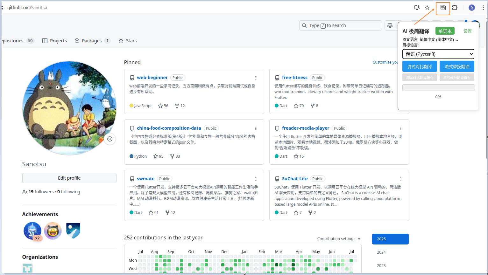
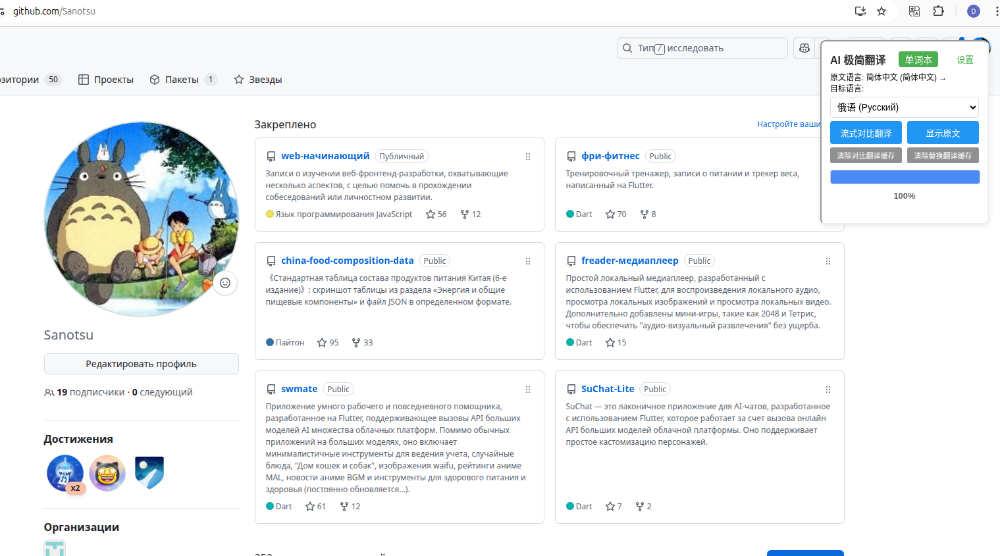
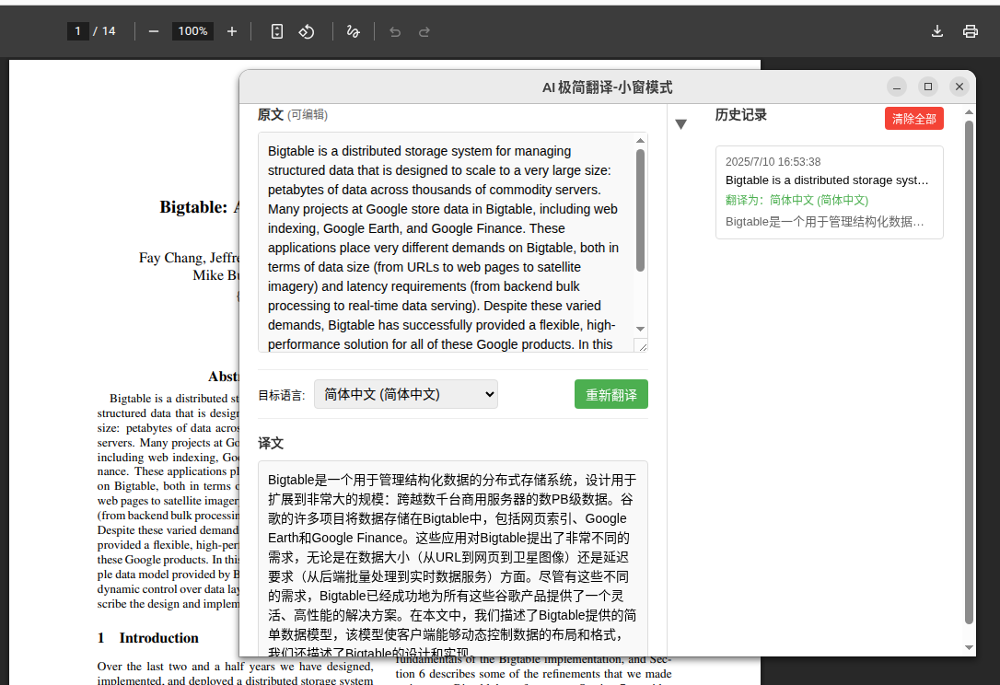

# 30 分钟，使用 cursor 开发的一个极简低配版"沉浸式翻译"chrome 插件

## 说明

- 这个插件是使用 cursor 的 composer 功能开发的，我本人是完全不懂 chrome 插件开发的。
- 翻译功能是基于调用在线服务大模型 API 实现的，所以需要使用者有可用的平台地址和 ak。
  - 可以试用下我写在代码里的是硅基流动中免费的模型 `Qwen/Qwen2.5-7B-Instruct`。
  - 当然，如果对硅基流动平台感兴趣，还能用下我的邀请码注册，那就更好了：
  - https://cloud.siliconflow.cn/i/tRIcST68
- 整页翻译的内容会保存在缓存中，1 小时内同一个网站不会重复调用 API 进行翻译。
  - 如果需要强制重新翻译，可以点击对应的清除缓存按钮后，重新翻译。

## 先看看效果

- 安装插件后，点击插件图标，右上角会显示出功能弹窗:

- 点击“设置”按钮，配置大模型平台地址、模型名、和 AK，**记得首次使用要保存设置才生效**。

- 整页翻译：对比翻译的效果

- 整页翻译：替换翻译的效果

- 划词翻译：对只需要翻译网页中部分文本，在选中文本(划词)后，会出现一个小的“翻译”按钮，点击之后就会弹窗显示翻译结果，目标语言在右上角的配置面板中指定。

- 如果是阅读 pdf 文件，或者也是一般网页，右键选择“AI 翻译助手-翻译选中文本”，会弹出独立翻译窗口。

- 这个独立窗口可以当成个简单的翻译工具，复制需要翻译的内容，选择目标语言，然后随意翻译即可。

## 其他补充

- 翻译效果和大模型质量相关
- 因为是调用大模型 API 进行翻译，网页内容过大时，可能完全翻译完会比较慢。
  - 可按 F12 在控制台查看当前正在调用 API 翻译的文本字段。
  - 可以随时停止翻译，刷新页面就恢复原网页，再次翻译会继续上次未完成的翻译(只要缓存未国期)。
- 只会翻译点击翻译时已经加载的内容
- 嵌入式（对比翻译）效果不一定好看

## 安装使用

下载这个项目，解压后，打开 chrome 或 edge 浏览器，进入 `chrome://extensions/` 或`edge://extensions/`页面，点击“加载已解压的扩展程序”，选择解压后的文件夹即可。

首次使用一定点击“设置”按钮或者插件图标右键选“选项”，去配置 API 地址、AK 和模型名称，点击“保存设置”。
